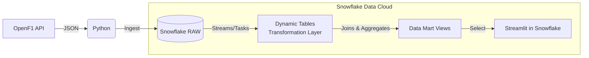

# F1 Data Engineering Project

## Project Overview

This is a Data Engineering hobby project focused on analyzing Formula 1 telemetry and race data. The primary goal is to build an automated pipeline that ingests race data, transforms it within a modern data warehouse, and visualizes a **2025 Championship Leaderboard** directly within Snowflake.

The project utilizes the **[OpenF1 API](https://api.openf1.org)** as the primary data source.

---

## Architecture

The project follows an **ELT (Extract, Load, Transform)** pattern, leveraging Snowflake's native capabilities for transformation and hosting the application.

## Data Pipeline Layers

* **Ingestion Layer (Raw):**
    * Python scripts fetch data from OpenF1 endpoints (Sessions, Drivers, Laps, Position).
    * Data is loaded into Snowflake `RAW` schema tables as Variant/JSON or raw structured data.
* **Transformation Layer (Integration):**
    * Uses **Snowflake Dynamic Tables** to manage declarative data transformations.
    * Handles data cleaning, type casting, and join logic (e.g., joining Driver info with Lap times).
* **Serving Layer (Data Mart):**
    * Secure Views built on top of Dynamic Tables.
    * Aggregates data for specific use cases (e.g., `VIEW_LEADERBOARD_2025`).
* **Application Layer:**
    * **Streamlit inside Snowflake (SiS)** app to visualize the leaderboard and race insights.

---

## Repository Structure

* `/.github/workflows`: CI/CD pipelines for automating data extraction and deployment.
* `/Snowflake`: SQL DDLs, Stored Procedures, and Streamlit app code.
    * `/Raw`: Tables for API landing.
    * `/Transform`: Dynamic Table definitions.
    * `/App`: Streamlit Python code.
* `/SetupEnv`: Environment configuration and Python requirements.
* `/sandbox`: Experimental scripts and Jupyter notebooks for data exploration.

---

## Roadmap

- [X] **Phase 1: Ingestion**
    - Set up Snowflake Database/Schema structure.
    - Create Python extraction script for OpenF1.
    - Load initial 2025 Session and Driver data into RAW tables.
    - Create Views to clean raw data.
- [ ] **Phase 2: Transformation**
    - Implement logic to calculate points and positions.
- [ ] **Phase 3: Visualization**
    - Create Data Mart views.
    - Build "Leaderboard 2025" Streamlit app in Snowflake.
- [ ] **Phase 4: Automation**
    - Schedule Tasks to run extraction after every race weekend.

---
